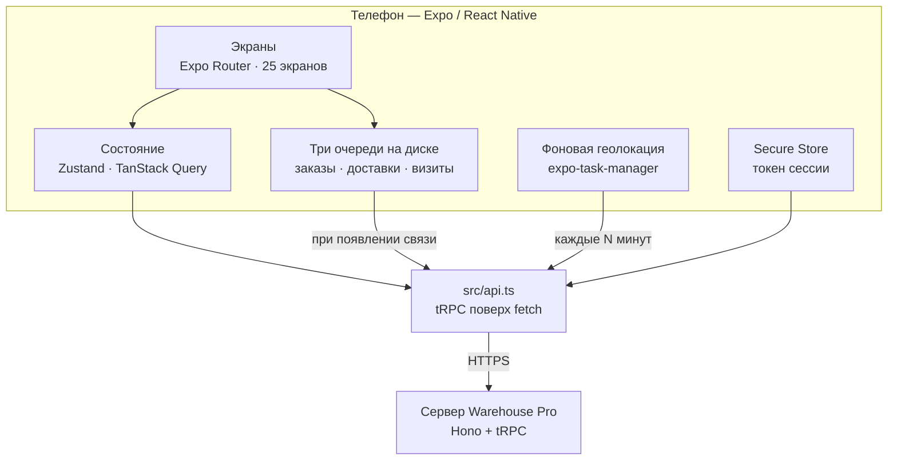

<div align="center">

<picture>
  <source media="(prefers-color-scheme: dark)" srcset="assets/brand/horizontal-dark.svg">
  
</picture>

**Телефон полевого сотрудника дистрибьютора**

Агент, курьер, мерчандайзер и супервайзер — каждый видит свою работу, и всё это работает без связи.

[](https://github.com/Nightcall7442/Warehouse-Pro-Mobile/actions/workflows/ci.yml)


</div>

---

## Какую задачу решает

Полевая работа дистрибьютора ломается не в офисе, а у полки магазина — там, где нет ни компьютера, ни связи:

| Где течёт | Что происходит на самом деле |
|---|---|
| **Заказ у полки** | Агент обещает то, чего нет на складе: остаток он видел утром. Вечером заказ переносится из тетради с ошибкой |
| **Подвал магазина** | Связи нет — заказ «не отправился», визит «не отмечен», курьер «не привёз». Кнопку жмут второй раз, и на сервере появляется дубль |
| **Маршрут** | Где был агент и был ли вообще, известно с его слов. План на день лежит в голове у супервайзера |
| **Деньги** | Долг магазина агент помнит примерно; чужой чек в кармане курьера растворяется до кассы |

Это приложение — рабочее место каждого из них. Агент оформляет заказ на телефоне и видит свободный остаток сервера, а не утренний; долг магазина — тот, что пересчитан из накладных и платежей. Курьер закрывает доставку с деньгами, отказом или частичным приёмом. Мерчандайзер сдаёт отчёт о визите с фотографией. Супервайзер видит агентов на карте, их след за день и заряд телефона.

**Без связи — три очереди, а не одна.** Заказы, отметки курьера и визиты с фото откладываются на диск и уходят при первой связи, по одному и по порядку. Повторная отправка не создаёт дубль: у каждого заказа свой ключ идемпотентности, и сервер отвечает уже созданным.

Сервер, веб-интерфейс и база живут отдельно: [Warehouse-Pro](https://github.com/Nightcall7442/Warehouse-Pro).

---

## Что внутри

**Агент**

- Главная «Мой день»: визиты на сегодня, долги, кто ждёт звонка
- Магазины по расстоянию от текущей точки, территории, новая точка с GPS и фото
- Каталог с фотографиями, экран товара: цена, остаток, штрих-код, упаковка, описание
- Новый заказ: корзина, скидки, способ оплаты, обещанный срок доставки, сканер штрих-кодов
- Мои заказы и их судьба: собран, отгружен, доставлен, возвращён
- Долги по моим заказам, зарплата за месяц с подтверждением получения
- План визитов на день и отметка «посещён» — тоже без связи

**Курьер**

- Доставки на сегодня в порядке объезда
- Закрытие: полностью, частично с причиной, отказ; деньги наличными или в долг
- Возврат товара прямо с экрана доставки

**Мерчандайзер**

- План визитов, отчёт о визите с фотографиями и напоминаниями
- Магазины своей территории

**Супервайзер и директор**

- Карта агентов: где сейчас, где был, заряд телефона
- Планы визитов и нормы продаж по агентам
- Должники по срокам долга — тот же расчёт, что и в веб-версии

**Общее**

- Русский и узбекский — переключатель в профиле, весь интерфейс двуязычный
- Оформление арендатора: логотип, название, цвета — приложение одно на всех
- Вход по e-mail и паролю, дальше — отпечаток или Face ID; экран запирается после простоя
- Уведомления: заказы, платежи, остатки, системные; толчок при выдаче зарплаты

---

## Как устроено



**Деньги считает сервер.** Приложение показывает свою сумму, но к оплате идёт та, что посчитал сервер по своим ценам на момент отправки. Себестоимости на телефоне нет вовсе — сервер не отдаёт её полевым ролям.

**Остаток — свободный, а не общий.** Каталог показывает `available` с основного склада: то, что не зарезервировано под чужие заказы. Продажа с другого склада с телефона невозможна по решению владельца.

**Роли задаёт сервер, вкладки — [src/lib/tabs.ts](src/lib/tabs.ts).** Правило видимости вынесено в чистую функцию и покрыто проверкой: вкладка, открывающая экран с отказом сервера, хуже отсутствующей.

**Геолокация в фоне — с раскрытием.** Перед включением слежения показывается экран, который говорит, что записывается, как часто, кто увидит и как выключить. Отказ ничего не ломает. Это требование магазинов приложений, и оно же — честность перед сотрудником: [docs/store-release.md](docs/store-release.md).

---

## Технологии

| Слой | Что используется |
|---|---|
| Каркас | Expo SDK 57, React Native 0.86, React 19 |
| Навигация | Expo Router (файловые маршруты) |
| Состояние | Zustand 5, TanStack Query 5 |
| Сеть | tRPC поверх `fetch`, свой клиент в `src/api.ts`; заказу — длинный таймаут, остальным 15 с |
| Хранилище | Secure Store (сессия), AsyncStorage (очереди, копии каталога, черновики) |
| Устройство | expo-location + task-manager, expo-camera, expo-local-authentication, expo-notifications, expo-battery |
| Карты | Яндекс.Карты в WebView (ключ — `EXPO_PUBLIC_YANDEX_MAPS_API_KEY`) |
| Шрифты | Manrope, JetBrains Mono — с кириллицей |
| Проверки | Jest (jest-expo, jsdom), Testing Library |
| Сборка | EAS Build, TypeScript 6 |

---

## Быстрый старт

Нужен **Node ≥ 22** и телефон с Expo Go или сборка для разработки.

```bash
git clone https://github.com/Nightcall7442/Warehouse-Pro-Mobile.git
```

```bash
npm ci
```

> `legacy-peer-deps` уже объявлен в `.npmrc` — флаг руками не нужен.

Укажите адрес сервера. Для телефона в той же сети — IP компьютера, не `localhost`:

```bash
echo EXPO_PUBLIC_API_URL=http://192.168.1.5:3000 > .env
```

Запустите:

```bash
npm start
```

Отсканируйте QR в Expo Go или нажмите `a` для Android-эмулятора. Учётные записи — те же, что засевает сервер (`agent-urgench@demo-uz.uz` / `password123` и другие из README сервера).

**Карта без ключа не откроется** — экран так и скажет. Ключ Яндекс.Карт задаётся переменной `EXPO_PUBLIC_YANDEX_MAPS_API_KEY`; в профиле `preview` на EAS он уже есть, а для локального запуска добавьте его в `.env`.

---

## Команды

```bash
npm start            # Expo dev server
npm run android      # на Android-устройстве или эмуляторе
npm run ios          # на iOS-симуляторе (macOS)
```

```bash
npm run typecheck    # типы
npm run lint         # линтер
npm test             # проверки (Jest)
```

```bash
npm run build:apk       # APK для внутренней раздачи (профиль preview)
npm run build:android   # сборка для магазина (app-bundle, профиль production)
```

---

## Проверки

| Что | Сколько |
|---|---|
| Проверок | около 600 в 65 файлах |
| Экранов | 25 |
| Ролей | 6: агент, курьер, мерчандайзер, супервайзер, оператор, директор |
| Языков | 2, храповик не даёт русской строке появиться без узбекской пары |

Сборка CI из двух работ, обе — на каждой ветке:

1. **Проверка** — типы, линтер, Jest, разбор `app.json` с раскрытием плагинов Expo. Последнее ловит то, чего не видят ни типы, ни линтер: сломанную настройку плагина или опечатку в разрешениях, которые иначе всплывают только в момент сборки, спустя минуты ожидания.
2. **Контракт с сервером** — сюда выкачивается серверный репозиторий, и `src/api.ts` сверяется с типами роутеров tRPC. Сервер переименовал поле, убрал ручку или сменил `query` на `mutation` — работа краснеет до сборки APK, а не после.

Что проверяется в самих тестах — не форма исходника, а сбои из поля: заказ без связи не пропадает, повторное нажатие не создаёт дубль, кнопка внизу экрана не уходит под системную панель Android, «плюс» не считает выше остатка, вкладка не показывается роли, которой сервер откажет.

Чего в сборке **намеренно нет** — `expo-doctor` и `eas build`; причины записаны прямо в [ci.yml](.github/workflows/ci.yml).

---

## Структура

```
├── app/                     экраны — файловые маршруты Expo Router
│   ├── (auth)/              вход
│   ├── (tabs)/              вкладки: главная, магазины, каталог, заказы,
│   │                        планы, нормы, доставки, долги, карта, профиль
│   ├── order/               новый заказ, заказ, закрытие доставки
│   ├── product/[id]         карточка товара
│   ├── shop/                магазин, новый магазин, ближайшие
│   ├── merchandiser/        отчёт о визите
│   └── debts · salary · notifications
├── src/
│   ├── api.ts               клиент tRPC — единственная дверь к серверу
│   ├── store/               сессия, оформление, очереди офлайна, блокировка
│   ├── lib/                 деньги заказа, скидки, единицы, статусы, маршрут курьера
│   ├── hooks/               биометрия, автоблокировка, геолокация, уведомления
│   ├── components/          общие детали и оформление
│   ├── backgroundLocation.ts фоновая задача геолокации
│   ├── i18n.ts              русский и узбекский
│   └── __tests__/           проверки
├── assets/brand/            логотип, значки, заставка
├── docs/store-release.md    публикация в Google Play и App Store
├── app.json · eas.json      конфигурация Expo и профили сборки
└── .github/workflows/ci.yml
```

---

## Роли и экраны

| Роль | Вкладки | Что ещё открывается |
|---|---|---|
| `agent` | Главная, Магазины, Каталог, Заказы, Профиль | План на день, долги, зарплата, GPS, сканер, карточка товара |
| `courier` | Главная, Доставки, Профиль | Закрытие доставки, возврат |
| `merchandiser` | Главная, Магазины, План, Профиль | Отчёт о визите |
| `supervisor` | Главная, Магазины, Планы, Нормы, Долги, Карта | Карточка магазина с правкой |
| `ceo` | то же, что супервайзер | — |
| `operator` | Главная, Магазины, Планы, Нормы, Долги | Карты агентов нет: сервер её оператору не отдаёт |

---

## Сборка и выпуск

Локальной сборки нет — на машине разработчика не нужны ни JDK, ни Android SDK. Всё собирает **EAS**:

```bash
npx eas-cli@latest build --platform android --profile preview --non-interactive --no-wait
```

| Профиль | Что даёт |
|---|---|
| `development` | сборка для разработки с dev-клиентом |
| `preview` | **APK** для внутренней раздачи — ставится обновлением поверх установленного |
| `production` | app-bundle для Google Play, номер версии ведёт сервер EAS |

Проект EAS принадлежит владельцу (`owner` в `app.json`). Сборка под другой учётной записью получит **другой ключ подписи**, и приложение не встанет обновлением — его придётся сносить с каждого телефона. Перед сборкой проверьте вход: `npx eas-cli@latest whoami`.

Публикация в магазины — отдельный документ с тем, что готово, что делает владелец руками и где могут отклонить: [docs/store-release.md](docs/store-release.md). Главный риск там не технический: приложение записывает местоположение сотрудника в фоне, и оба магазина проверяют такие приложения пристальнее всего остального.

---

## Документация

- [Публикация в Google Play и App Store](docs/store-release.md)
- [Сервер и веб-интерфейс](https://github.com/Nightcall7442/Warehouse-Pro) — архитектура, развёртывание, роли
- [Руководство дистрибьютора](https://github.com/Nightcall7442/Warehouse-Pro/tree/main/docs/manual) — по ролям, со снимками экранов телефона

---

## Лицензия

Проприетарная, все права защищены. Условия — в [LICENSE](https://github.com/Nightcall7442/Warehouse-Pro/blob/main/LICENSE) основного репозитория.
